# H3 Robot API Server — Tài liệu API

**Base URL:** `http://<ROBOT_IP>:8090`  
**Content-Type:** `application/json`  
**Docs (Swagger UI):** `http://<ROBOT_IP>:8090/docs`

---

## 1. Bảng thống kê các API

### REST Endpoints

| # | Nhóm | Method | Endpoint | Mô tả | Cần Nav2 |
|---|------|--------|----------|-------|:--------:|
| 1 | System | `GET` | `/robot/status` | Trạng thái tổng quan robot | ✗ |
| 2 | Chassis | `POST` | `/chassis/moves` | Di chuyển đến điểm / sạc / xoay | ✓ |
| 3 | Chassis | `GET` | `/chassis/moves/current` | Trạng thái di chuyển hiện tại | ✗ |
| 4 | Chassis | `PATCH` | `/chassis/moves/current` | Huỷ di chuyển | ✓ |
| 5 | Chassis | `GET` | `/chassis/pose` | Đọc vị trí hiện tại | ✗ |
| 6 | Chassis | `POST` | `/chassis/pose` | Đặt lại vị trí robot (AMCL) | ✗ |
| 7 | Chassis | `POST` | `/chassis/twist` | Điều khiển vận tốc tức thời | ✗ |
| 8 | Chassis | `DELETE` | `/chassis/twist` | Dừng robot ngay lập tức | ✗ |
| 9 | Chassis | `POST` | `/chassis/rotate` | Xoay đến góc chỉ định | ✗ |
| 10 | Maps | `POST` | `/chassis/current-map` | Đổi bản đồ đang dùng | ✗ |
| 11 | Maps | `GET` | `/maps/` | Danh sách bản đồ | ✗ |
| 12 | Tray | `POST` | `/tray/open` | Mở khay đựng hàng | ✗ |
| 13 | Tray | `POST` | `/tray/close` | Đóng khay đựng hàng | ✗ |
| 14 | Tray | `GET` | `/tray/status` | Trạng thái khay | ✗ |
| 15 | Safety | `POST` | `/emergency-stop` | Kích hoạt dừng khẩn cấp | ✗ |
| 16 | Safety | `POST` | `/emergency-stop/release` | Giải phóng dừng khẩn cấp | ✗ |
| 17 | Safety | `GET` | `/emergency-stop/status` | Trạng thái e-stop | ✗ |
| 18 | System | `POST` | `/system/restart` | Khởi động lại ROS node | ✗ |

### WebSocket Endpoints

| # | Endpoint | Tần suất | Dữ liệu |
|---|----------|----------|---------|
| 1 | `ws://.../ws/pose` | 200ms | Toạ độ x, y, yaw_deg |
| 2 | `ws://.../ws/battery` | 2s | Pin %, voltage, current, status |
| 3 | `ws://.../ws/speed` | 200ms | linear_x, linear_y, angular_z |
| 4 | `ws://.../ws/status` | 500ms | Tổng hợp tất cả trạng thái |

---

## 2. Chi tiết các API

---

### 2.1 `GET /robot/status` — Trạng thái tổng quan

**Mô tả:** Trả về toàn bộ trạng thái hiện tại của robot trong một lần gọi.

**Request:** Không có body.

**Response `200 OK`:**
```json
{
  "pose": { "x": 1.23, "y": -0.45, "yaw_deg": 90.0 },
  "speed": { "linear_x": 0.0, "linear_y": 0.0, "angular_z": 0.0 },
  "battery": { "percentage": 85.0, "voltage": 24.1, "current": -1.2, "status": "discharging" },
  "move_state": "idle",
  "emergency_stop": false,
  "tray_open": false,
  "current_map": "lobby_v5"
}
```

| Trường | Kiểu | Ý nghĩa |
|--------|------|---------|
| `move_state` | string | `idle` / `moving` / `completed` / `cancelled` / `failed` |
| `battery.status` | string | `charging` / `discharging` / `full` / `not_charging` / `unknown` |

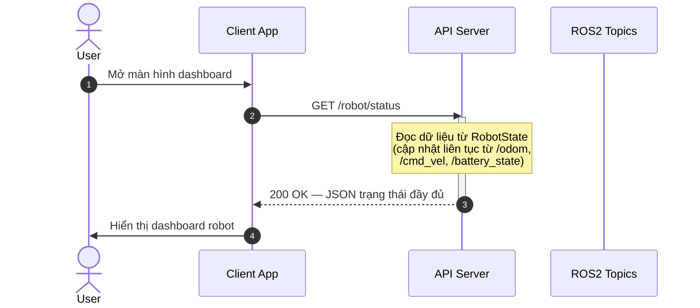

---

### 2.2 `POST /chassis/moves` — Di chuyển robot

**Mô tả:** Gửi lệnh di chuyển cho robot. Hỗ trợ 3 loại (`type`):
- `standard` — điều hướng đến toạ độ chỉ định
- `charge` — quay về trạm sạc
- `rotate` — xoay tại chỗ đến góc chỉ định

**Request Body:**
```json
{
  "type": "standard",
  "target_x": 2.5,
  "target_y": 1.0,
  "target_z": 0.0,
  "target_ori": 90.0,
  "target_accuracy": 0.1,
  "use_target_zone": false,
  "approach_speed_limit": null,
  "creator": "android_app"
}
```

| Trường | Bắt buộc | Mặc định | Mô tả |
|--------|:--------:|---------|-------|
| `type` | ✓ | `"standard"` | Loại di chuyển |
| `target_x` | Nếu type=standard | — | Toạ độ X đích (mét) |
| `target_y` | Nếu type=standard | — | Toạ độ Y đích (mét) |
| `target_ori` | ✗ | `0.0` | Góc quay đích (độ) |
| `target_accuracy` | ✗ | `0.1` | Độ chính xác dừng (mét) |
| `approach_speed_limit` | ✗ | `null` | Tốc độ tiếp cận tối đa (m/s) |
| `creator` | ✗ | `"api"` | Tên client gọi API |

**Response `200 OK`:**
```json
{
  "status": "accepted",
  "type": "standard",
  "goal": { "x": 2.5, "y": 1.0, "yaw_deg": 90.0 },
  "detail": "completed"
}
```

**Lỗi:**
- `409` — Robot đang di chuyển hoặc e-stop đang bật
- `422` — Thiếu `target_x` / `target_y` khi `type=standard`

#### Luồng: `type = "standard"`

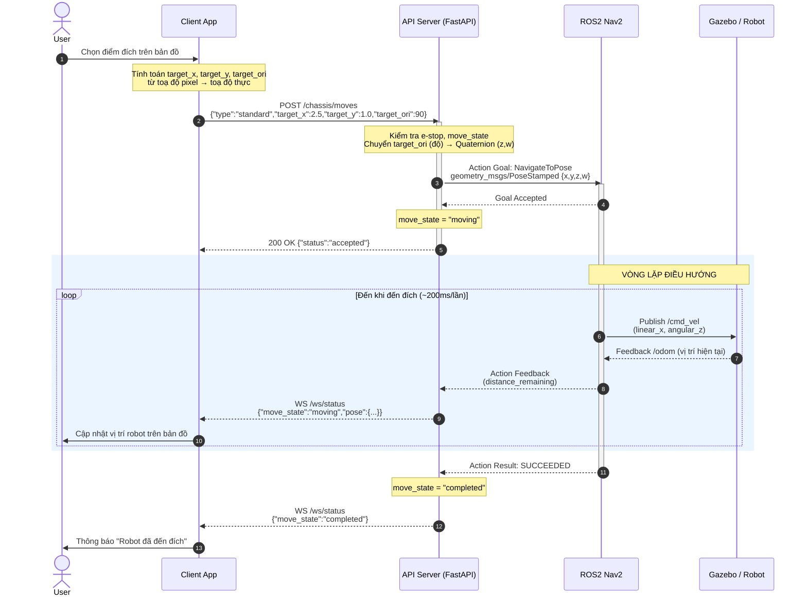

#### Luồng: `type = "charge"`

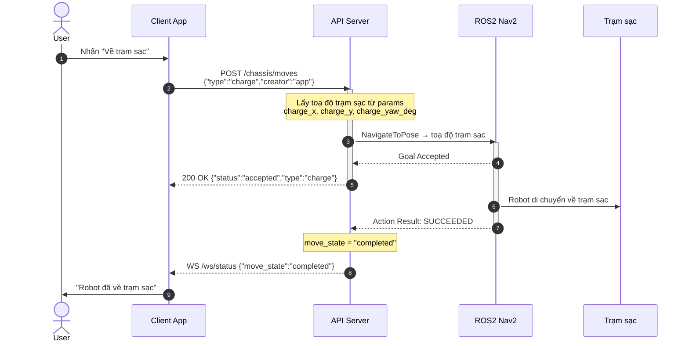

---

### 2.3 `GET /chassis/moves/current` — Trạng thái di chuyển

**Mô tả:** Lấy trạng thái di chuyển hiện tại và vị trí robot.

**Response `200 OK`:**
```json
{
  "move_state": "moving",
  "pose": { "x": 1.1, "y": 0.5, "yaw_deg": 45.0 }
}
```

---

### 2.4 `PATCH /chassis/moves/current` — Huỷ di chuyển

**Mô tả:** Huỷ lệnh điều hướng đang thực hiện, robot dừng lại.

**Request Body:**
```json
{ "state": "cancelled" }
```

**Response `200 OK`:**
```json
{ "status": "cancelled" }
```

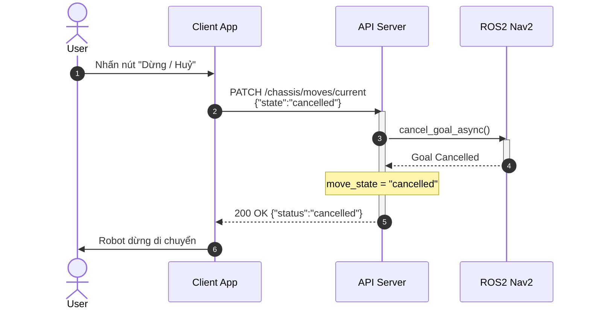

---

### 2.5 `GET /chassis/pose` — Đọc vị trí hiện tại

**Mô tả:** Trả về toạ độ và hướng hiện tại của robot (lấy từ topic `/odom`).

**Response `200 OK`:**
```json
{ "x": 1.23, "y": -0.45, "yaw_deg": 90.0 }
```

| Trường | Đơn vị | Mô tả |
|--------|--------|-------|
| `x` | mét | Vị trí trục X trong frame `map` |
| `y` | mét | Vị trí trục Y trong frame `map` |
| `yaw_deg` | độ | Góc quay quanh trục Z (0° = hướng Đông) |

---

### 2.6 `POST /chassis/pose` — Đặt lại vị trí robot

**Mô tả:** Gửi `initialpose` để AMCL/SLAM tái định vị robot tại vị trí chỉ định. Dùng khi robot bị lạc hoặc mới bật lên.

**Request Body:**
```json
{ "x": 0.0, "y": 0.0, "z": 0.0, "orientation": 0.0 }
```

| Trường | Mô tả |
|--------|-------|
| `x`, `y` | Toạ độ thực trên bản đồ (mét) |
| `orientation` | Góc yaw ban đầu (độ) |

**Response `200 OK`:**
```json
{
  "status": "ok",
  "pose": { "x": 0.0, "y": 0.0, "yaw_deg": 0.0 }
}
```

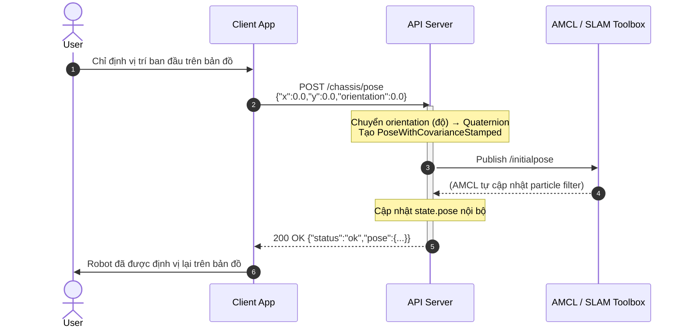

---

### 2.7 `POST /chassis/twist` — Điều khiển vận tốc

**Mô tả:** Gửi lệnh vận tốc trực tiếp đến robot (publish `/cmd_vel`). Thích hợp cho điều khiển thủ công.

> ⚠️ **Lưu ý:** Lệnh này ghi đè Nav2. Không dùng đồng thời với navigation.

**Request Body:**
```json
{ "linear_x": 0.3, "linear_y": 0.0, "angular_z": 0.5 }
```

| Trường | Đơn vị | Phạm vi | Mô tả |
|--------|--------|---------|-------|
| `linear_x` | m/s | `[-1.0, 1.0]` | Tốc độ tiến/lùi |
| `linear_y` | m/s | `[-1.0, 1.0]` | Tốc độ trượt ngang (robot holonomic) |
| `angular_z` | rad/s | `[-2.0, 2.0]` | Tốc độ xoay (+ = trái) |

**Response `200 OK`:**
```json
{
  "status": "ok",
  "twist": { "linear_x": 0.3, "linear_y": 0.0, "angular_z": 0.5 }
}
```

**Lỗi:** `409` — E-stop đang bật.

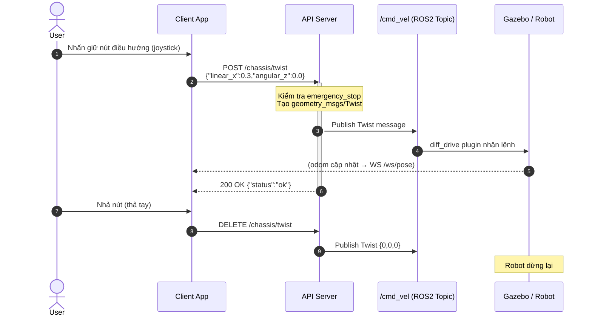

---

### 2.8 `DELETE /chassis/twist` — Dừng robot ngay

**Mô tả:** Gửi lệnh vận tốc zero, robot dừng ngay lập tức.

**Response `200 OK`:**
```json
{ "status": "stopped" }
```

---

### 2.9 `POST /chassis/rotate` — Xoay đến góc chỉ định

**Mô tả:** Xoay robot tại chỗ đến góc yaw mong muốn (không cần Nav2).

**Request Body:**
```json
{ "angle": 90.0, "angular_speed": 0.4 }
```

| Trường | Mặc định | Mô tả |
|--------|---------|-------|
| `angle` | — | Góc đích (độ, tuyệt đối trong frame map) |
| `angular_speed` | `0.5` | Tốc độ xoay (rad/s) |

**Response `200 OK`:**
```json
{ "status": "accepted", "target_yaw_deg": 90.0, "detail": "completed" }
```

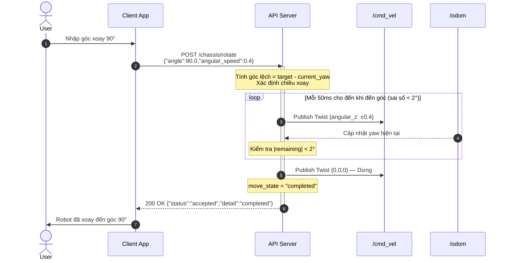

---

### 2.10 `POST /chassis/current-map` — Đổi bản đồ

**Mô tả:** Cập nhật bản đồ đang sử dụng (thay đổi metadata nội bộ; để tải bản đồ thực vào Nav2 cần restart map_server).

**Request Body:**
```json
{ "map_id": "elevator" }
```

**Response `200 OK`:**
```json
{ "status": "ok", "current_map": "elevator" }
```

---

### 2.11 `GET /maps/` — Danh sách bản đồ

**Mô tả:** Liệt kê tất cả file bản đồ `.yaml` trong thư mục `maps_dir` (cấu hình qua launch param).

**Response `200 OK`:**
```json
{
  "maps": [
    { "map_id": "elevator", "path": "/share/h3_slam/maps/elevator.yaml" },
    { "map_id": "lobby_v5", "path": "/share/h3_slam/maps/lobby_v5.yaml" },
    { "map_id": "warehouse", "path": "/share/h3_slam/maps/warehouse.yaml" }
  ],
  "count": 3
}
```

---

### 2.12 `POST /tray/open` & `POST /tray/close` — Điều khiển khay

**Mô tả:** Điều khiển khay đựng hàng của robot. Publish lên topic `/tray/command` (std_msgs/Bool).

**Response `200 OK`:**
```json
{ "status": "ok", "tray": "open" }
{ "status": "ok", "tray": "closed" }
```

**`GET /tray/status`:**
```json
{ "tray_open": true }
```

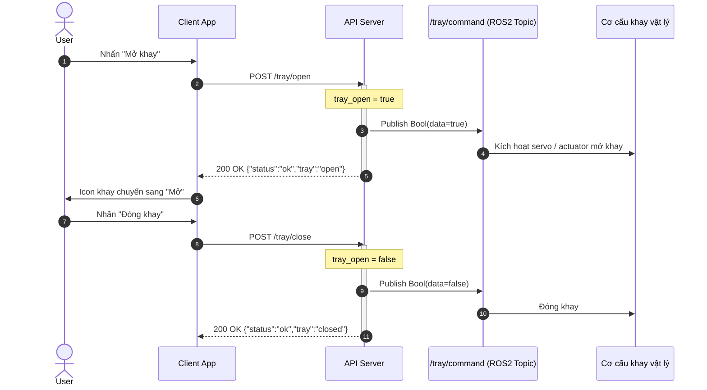

---

### 2.13 `POST /emergency-stop` & `POST /emergency-stop/release` — Dừng khẩn cấp

**Mô tả:**
- `/emergency-stop` — Dừng robot ngay, huỷ navigation, khoá mọi lệnh di chuyển.
- `/emergency-stop/release` — Giải phóng, cho phép điều khiển lại.

**Response `200 OK`:**
```json
{ "status": "ok", "emergency_stop": true }
{ "status": "ok", "emergency_stop": false }
```

**`GET /emergency-stop/status`:**
```json
{ "emergency_stop": false }
```

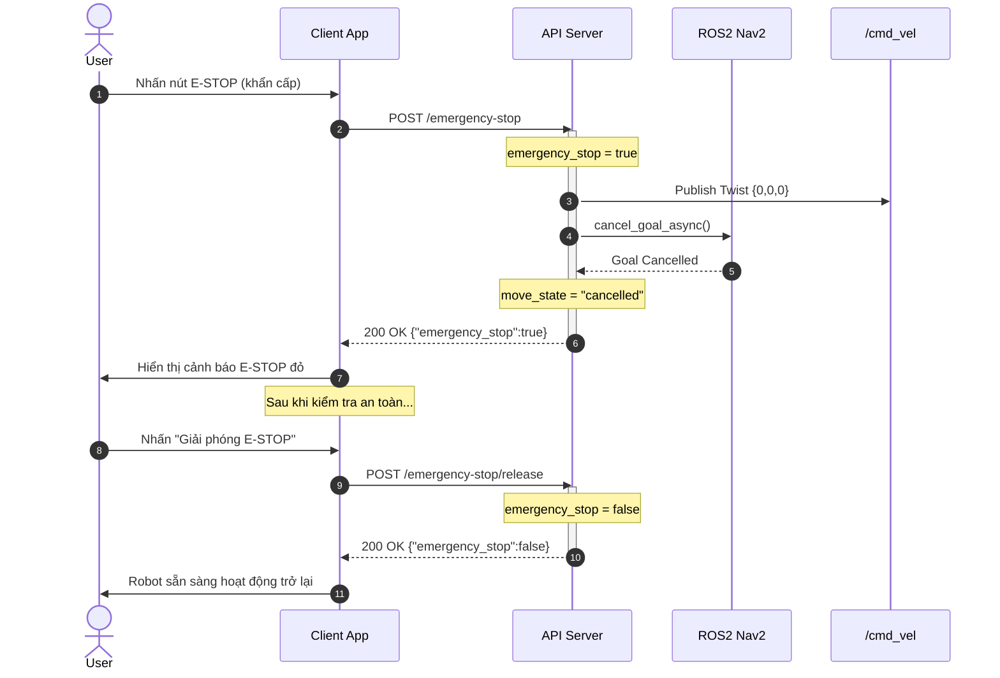

---

### 2.14 `POST /system/restart` — Khởi động lại

**Mô tả:** Shutdown ROS2 node. Thường dùng kết hợp với systemd/supervisor để tự khởi động lại.

**Response `200 OK`:**
```json
{ "status": "restarting" }
```

---

## 3. WebSocket Endpoints

### Cách kết nối

**JavaScript:**
```javascript
const ws = new WebSocket('ws://ROBOT_IP:8090/ws/status');
ws.onmessage = (event) => {
  const data = JSON.parse(event.data);
  console.log(data);
};
```

**Python:**
```python
import asyncio, websockets, json

async def listen():
    async with websockets.connect('ws://ROBOT_IP:8090/ws/status') as ws:
        async for msg in ws:
            print(json.loads(msg))

asyncio.run(listen())
```

---

### 3.1 `WS /ws/pose` — Toạ độ real-time (200ms)

```json
{ "x": 1.23, "y": -0.45, "yaw_deg": 90.0 }
```

### 3.2 `WS /ws/battery` — Pin (2s)

```json
{ "percentage": 85.0, "voltage": 24.1, "current": -1.2, "status": "discharging" }
```

### 3.3 `WS /ws/speed` — Tốc độ (200ms)

```json
{ "linear_x": 0.3, "linear_y": 0.0, "angular_z": 0.0 }
```

### 3.4 `WS /ws/status` — Tổng hợp (500ms)

```json
{
  "pose": { "x": 1.23, "y": -0.45, "yaw_deg": 90.0 },
  "speed": { "linear_x": 0.3, "linear_y": 0.0, "angular_z": 0.0 },
  "battery": { "percentage": 85.0, "voltage": 24.1, "current": -1.2, "status": "discharging" },
  "move_state": "moving",
  "emergency_stop": false,
  "tray_open": false,
  "current_map": "lobby_v5"
}
```

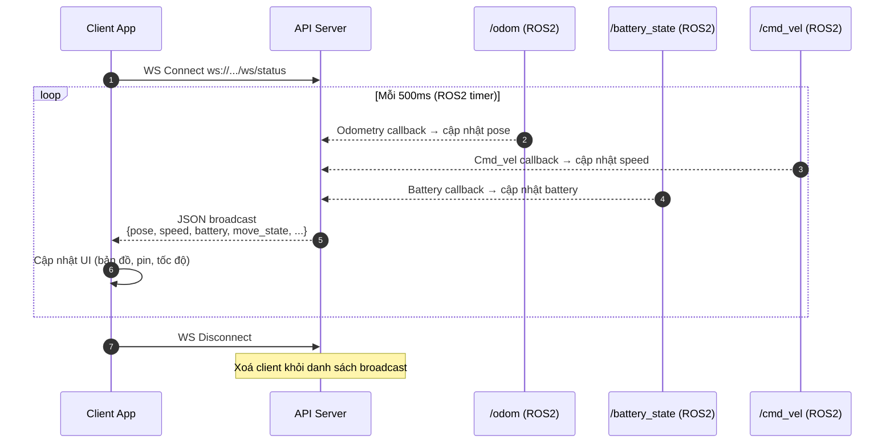

---

## 4. Luồng tích hợp đầy đủ — Android App

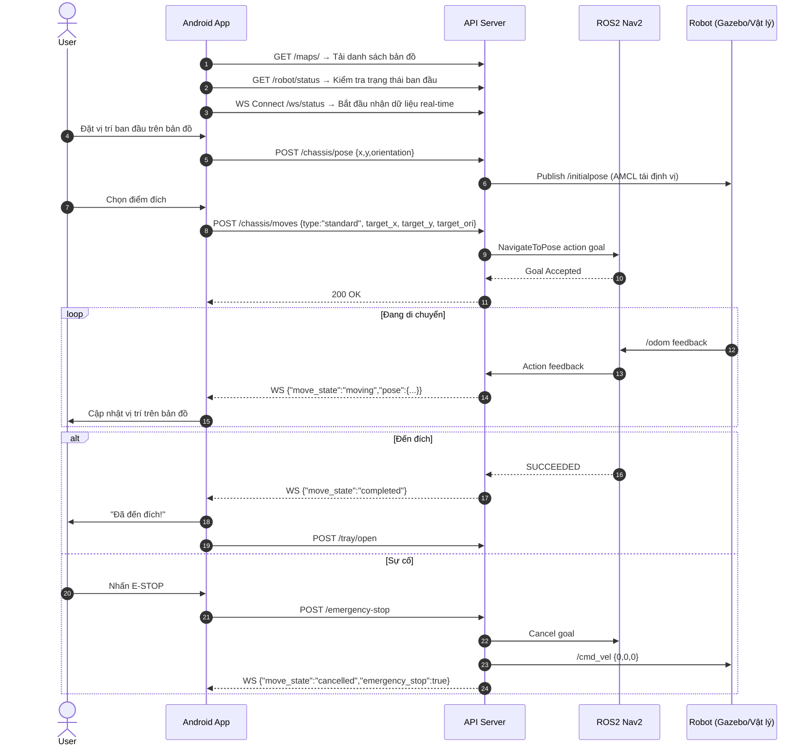

---

## 5. Cấu hình Launch Parameters

| Parameter | Mặc định | Mô tả |
|-----------|---------|-------|
| `host` | `0.0.0.0` | Địa chỉ bind server |
| `port` | `8090` | Cổng HTTP/WebSocket |
| `maps_dir` | `<h3_slam>/maps` | Thư mục chứa bản đồ |
| `charge_x` | `0.0` | Toạ độ X trạm sạc |
| `charge_y` | `0.0` | Toạ độ Y trạm sạc |
| `charge_yaw_deg` | `0.0` | Góc quay tại trạm sạc (độ) |

```bash
ros2 launch h3_api_server h3_api_server.launch.py \
  host:=0.0.0.0 \
  port:=8090 \
  charge_x:=1.5 \
  charge_y:=-0.5 \
  charge_yaw_deg:=180.0
```

---

## 6. Mã lỗi HTTP

| Code | Ý nghĩa | Ví dụ |
|------|---------|-------|
| `200` | Thành công | — |
| `409` | Xung đột trạng thái | Robot đang di chuyển / E-stop đang bật |
| `422` | Dữ liệu không hợp lệ | Thiếu `target_x` khi `type=standard` |
| `500` | Lỗi server | Nav2 không phản hồi |
